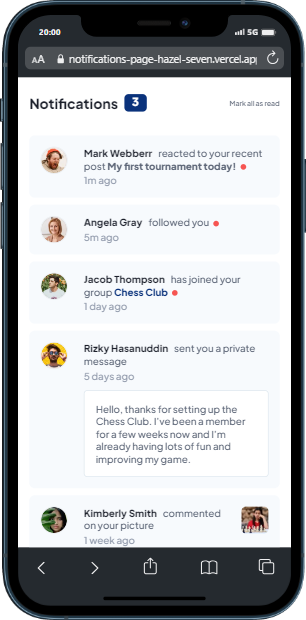
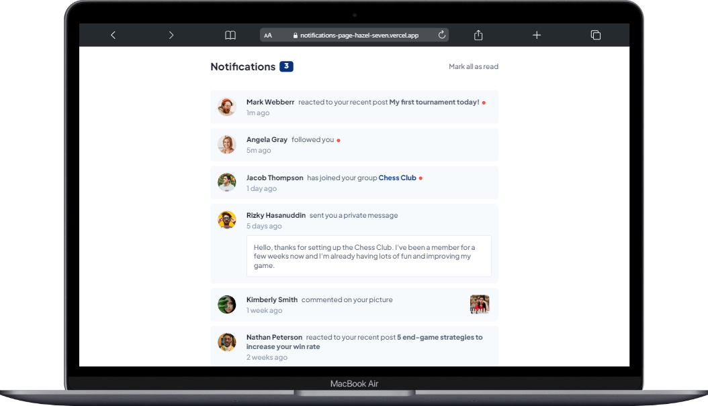

# Frontend Mentor - Notifications page solution

<p align="center">


<a href="https://github.com/Fransuelton/notifications-page/main">

</a><a href="https://github.com/Fransuelton/notifications-page/stargazers">
</a>
</p>

## 💻 About the project

📄 This is a solution to the [Notifications page challenge on Frontend Mentor](https://www.frontendmentor.io/challenges/notifications-page-DqK5QAmKbC). Frontend Mentor challenges help you improve your coding skills by building realistic projects. 

## 🎯 The challenge

Users should be able to:

- Distinguish between "unread" and "read" notifications
- Select "Mark all as read" to toggle the visual state of the unread notifications and set the number of unread messages to zero
- View the optimal layout for the interface depending on their device's screen size
- See hover and focus states for all interactive elements on the page

## 🛠️ Built with

- Semantic HTML5 markup
- CSS custom properties
- Flexbox
- Mobile-first workflow
- Vite
- [React](https://reactjs.org/) - JS library
- [Styled Components](https://styled-components.com/) - For styles

---

## 🎨 Layout
### Mobile

### Web

---

### Prerequisites

Before you begin, you will need to have installed on your machine the following tools:
[Git](https://git-scm.com), [Node.js](https://nodejs.org/en/). Also, it's good to have an editor to work with the code, such as: [VSCode](https://code.visualstudio.com/)

#### 🧭 Running the web application (Frontend)

```bash

# Clone this repository
$ git clone https://github.com/Fransuelton/notifications-page.git

# Access the project folder in your terminal/cmd
$ cd notifications-page

# Install the dependencies
$ npm install

# Run the application in development mode
$ npm run dev

# The application will open at the door:3000 - access http://localhost:3000 or other

```
---

## 🧙‍♂️ Author

<table>
  <tr>
    <td align="center">
    <br /><sub><b>Fransuelton</b></sub>
    </td>
  </tr>
</table>

---

Made with ❤️ [Contact me!](https://www.linkedin.com/in/fransuelton/)